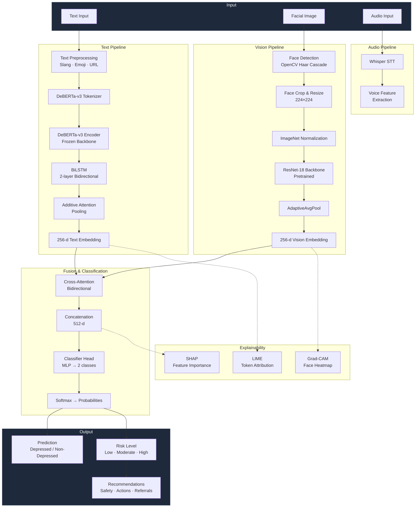

# Architecture Diagram — EmotiSense AI

```mermaid
graph TB
    subgraph Input
        Text[Text Input]
        Image[Facial Image]
        Audio[Audio Input]
    end

    subgraph "Text Pipeline"
        Preprocess[Text Preprocessing<br/>Slang · Emoji · URL]
        Tokenizer[DeBERTa-v3 Tokenizer]
        Encoder[DeBERTa-v3 Encoder<br/>Frozen Backbone]
        BiLSTM[BiLSTM<br/>2-layer Bidirectional]
        TextAttn[Additive Attention<br/>Pooling]
        TextEmb[256-d Text Embedding]
    end

    subgraph "Vision Pipeline"
        FaceDetect[Face Detection<br/>OpenCV Haar Cascade]
        FaceCrop[Face Crop & Resize<br/>224×224]
        ImgNorm[ImageNet Normalization]
        ResNet[ResNet-18 Backbone<br/>Pretrained]
        VisionPool[AdaptiveAvgPool]
        VisionEmb[256-d Vision Embedding]
    end

    subgraph "Audio Pipeline"
        Whisper[Whisper STT]
        VoiceFeats[Voice Feature<br/>Extraction]
    end

    subgraph "Fusion & Classification"
        CrossAttn[Cross-Attention<br/>Bidirectional]
        Concat[Concatenation<br/>512-d]
        Classifier[Classifier Head<br/>MLP → 2 classes]
        Softmax[Softmax → Probabilities]
    end

    subgraph "Explainability"
        LIME[LIME<br/>Token Attribution]
        SHAP[SHAP<br/>Feature Importance]
        GradCAM[Grad-CAM<br/>Face Heatmap]
    end

    subgraph "Output"
        Prediction[Prediction<br/>Depressed / Non-Depressed]
        Risk[Risk Level<br/>Low · Moderate · High]
        Recs[Recommendations<br/>Safety · Actions · Referrals]
    end

    Text --> Preprocess --> Tokenizer --> Encoder --> BiLSTM --> TextAttn --> TextEmb
    Image --> FaceDetect --> FaceCrop --> ImgNorm --> ResNet --> VisionPool --> VisionEmb
    Audio --> Whisper --> VoiceFeats

    TextEmb --> CrossAttn
    VisionEmb --> CrossAttn
    CrossAttn --> Concat --> Classifier --> Softmax

    Softmax --> Prediction
    Softmax --> Risk
    Risk --> Recs

    TextEmb -.-> LIME
    VisionEmb -.-> GradCAM
    Concat -.-> SHAP

    style Input fill:#1e293b,stroke:#475569,color:#f8fafc
    style Output fill:#1e293b,stroke:#475569,color:#f8fafc
```
